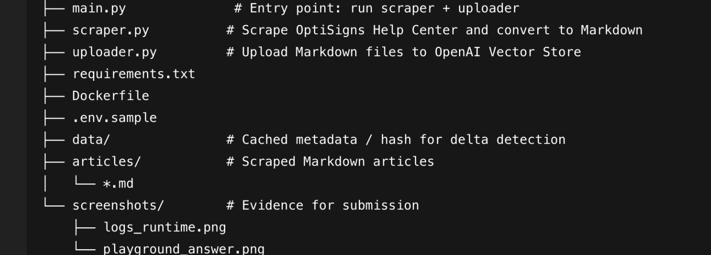
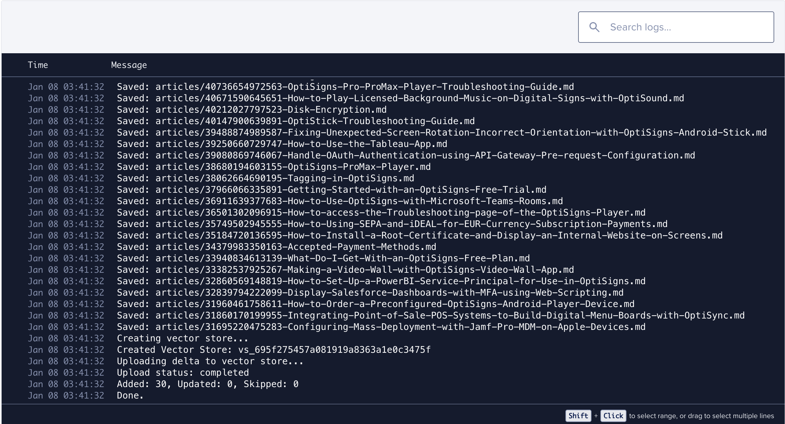
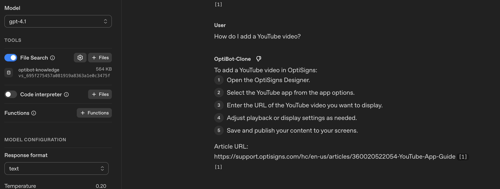

# OptiBot Mini-Clone

This project scrapes OptiSigns Help Center articles, converts them to clean Markdown,
uploads them into an OpenAI Vector Store, and builds an Assistant that answers questions
using only the uploaded documentation.

---

## Project Structure

---
## 1. Setup

Requirements:
- Python 3.10+
- OpenAI API Key

Create environment file:
- cp .env.sample .env

Add your API key:
- OPENAI_API_KEY=sk-xxxxxxxx

Install dependencies:
pip install -r requirements.txt

## 2. Run Locally
Run once:
``python main.py``

This will:
1. Scrape articles from https://support.optisigns.com
2. Convert them to clean Markdown files
3. Upload only new or updated files to OpenAI Vector Store

## 3. Docker
Build Image :
``docker build -t optibot .``

Run Container :
``
docker run -e OPENAI_API_KEY=xxx -v $(pwd)/data:/data -v $(pwd)/articles:/app/articles optibot 
``
- The container runs once and exits with status 0.

## 4. Vector Store & Chunking Strategy
- All Markdown files are uploaded programmatically via OpenAI API (no UI drag-and-drop).
- Each article is stored as one document in the vector store.
- Delta detection is based on file hash:
  - New file → Added
  - Changed file → Updated
  - Unchanged file → Skipped 
## Example log:

## 5. Assistant Test (Playground)

The Assistant was created with the required system prompt and attached to the vector store.

Tested question:
- How do I add a YouTube video?

## Result :

## 6. Daily Job

The scraper and uploader are deployed as a scheduled job on DigitalOcean.

Frequency: once per day

Job logs: https://cloud.digitalocean.com/apps/0644c564-a4ad-4c7e-ace5-aead3656f816/logs?i=c22e53

The job performs:
- Re-scraping of articles
- Detection of new/updated content
- Upload of only the delta

## 7. Notes
- No API keys are hard-coded. Environment variables are used via .env.